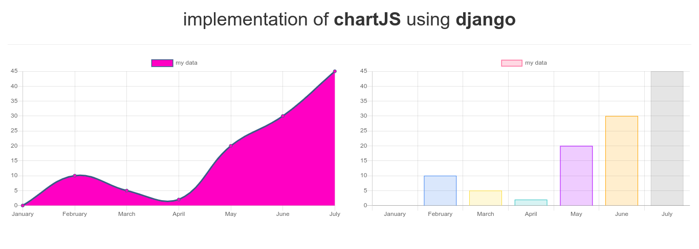

# implementation of chartjs using django

&nbsp;

With the growth of data, <b>data visualization</b> in become a import part here we will implement chart for our data in our web apps using chartjs with django

Django is a high-level Python Web framework based web framework and chartjs is an easy way to include animated, interactive graphs.

<a href="https://www.geeksforgeeks.org/data-visualization-using-chartjs-and-django/">read about it on geeksforgeeks</a>

<a href="https://www.chartjs.org/" >learn about chartJS</a>

